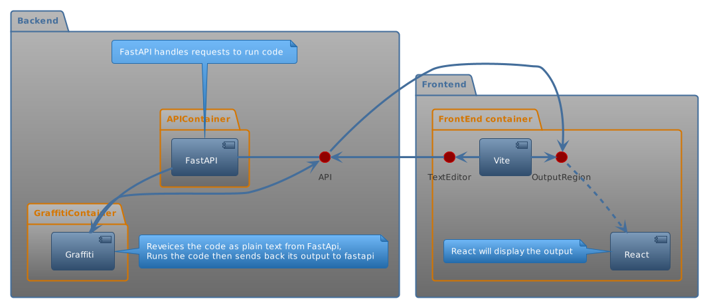

# Table of Contents

1.  [Getting Started](#org30a8385)
2.  [Poetry2Nix](#orgab119b7)
3.  [Getting the dummy program working](#orga24d2cc)
4.  [Getting your app running as a flake](#orga14a127)
5.  [Reccomneded](#org7c9111f)
6.  [Docker setup](#orgfa43467)
    1.  [build](#org7db8b76)
    2.  [run](#orgdebda38)
7.  [Adding python packages to poetry](#org97265a9)
8.  [NPM Packages](#orgf047c46)
    1.  [Vite and react](#org3c248c5)
9.  [PlantUML for diagrams](#org882533c)
10. [References](#orgd642df0)

# Getting Started

>Goal-> Create a website where users could evaluate my programming language graffiti hosted on the cloud

I undestand that serverless means I will have to host my app as a docker container, however I never use docker locally due to my experince of it being much slower than an non containerized local install.  I use nix for local environments so it makse sense to use nix to make my dockeimage  [docker-nix](https://johns.codes/blog/rust-enviorment-and-docker-build-with-nix-flakes) was A great resource to get started.  

# Poetry2Nix

This is super nice it makes building a python derivation super straight forward [poetry2nix](https://github.com/nix-community/poetry2nix/blob/master/bin/poetry2nix) also see examlpe usage here from [tweag](https://www.tweag.io/blog/2020-08-12-poetry2nix/). 

What I needed to do to set up the project

    
    poetry new <project-name>
    poetry build
    
    poetry add <dependencies> <dependencies> ... 

This is the best way I have found for poetry to set up the instance with everything in the proper spot

# Getting the dummy program working

This is neede or else your result will be empty

    [tool.poetry.scripts]
    runner = "project_new.app:main"

This is the app file, it will contain your main script. 

    def main():
        print("bruh")

    
    poetry run runner

# Getting your app running as a flake

I am not going to explain all this but essentialy you create a derivation with the poetry2nix which then can set as a default package output

    {
      description = "A simple poetry project";
    
      inputs = {
        nixpkgs.url = "github:NixOS/nixpkgs";
        flake-utils.url = "github:numtide/flake-utils";
        poetry2nix.url = "github:nix-community/poetry2nix";
      };
    
      outputs = { self, nixpkgs, flake-utils, poetry2nix }:
        flake-utils.lib.eachDefaultSystem (system:
          let
            pkgs = import nixpkgs { inherit system; };
            inherit (poetry2nix.lib.mkPoetry2Nix { inherit pkgs; }) mkPoetryApplication;
    
            project-new = mkPoetryApplication {
              projectDir = ./projectDir; # Replace with actual project directory
            };
    
          in {
            packages = {
              inherit project-new;
            };
            defaultPackage = project-new;
          });
    }

Building your script

    nix build 

Running your script

    ./result/bin/runner # The executable is called runner because of what we named it in pyproject.toml

# Reccomneded

Highly reccomnend setting up your poetry envrionment as well for well integrated repl develompent.  This means you will have a repl with all your poetry dependencies

    
    
    {
      description = "A simple poetry project";
    
      inputs = {
        nixpkgs.url = "github:NixOS/nixpkgs";
        flake-utils.url = "github:numtide/flake-utils";
        poetry2nix.url = "github:nix-community/poetry2nix";
      };
    
      outputs = { self, nixpkgs, flake-utils, poetry2nix }:
        flake-utils.lib.eachDefaultSystem (system:
          let
            pkgs = import nixpkgs { inherit system; };
            inherit (poetry2nix.lib.mkPoetry2Nix { inherit pkgs; }) mkPoetryApplication;
            inherit (poetry2nix.lib.mkPoetry2Nix { inherit pkgs; }) mkPoetryEnv;
    
            project-new = mkPoetryApplication {
              projectDir = ./project-new; # Replace with actual project directory
            };
            dep-env = mkPoetryEnv {
              projectDir = ./project-new; # Replace with actual project directory
            };
    
          in {
            packages = {
              inherit project-new;
            };
            defaultPackage = project-new;
            devShells.default = pkgs.mkShell {
              packages = [dep-env];
             };
          });
    }

# Docker setup

Add the following to the let stmts above 

    
    
    dockerImage = pkgs.dockerTools.buildImage {
      name = "my-flake-docker-image";
      tag = "latest";
      config = {
        cmd = [ "${project-new}/bin/runner" ];
      };
    };
    
    # ...
    
    packages = {
      docker = docker-image;
    };

## build

    
    # The output shold be a result pointing to a tar.gz file
    nix build ./#docker
    
    docker load < result 

## run

    docker run my-flake-docker-image:latest

Success!!

This is the basic setup for getting a python project up and running and packages into a docker container

# Adding python packages to poetry

I was having issues adding fastapi to poetry due to an issue with watchfiles 0.24.0 so I installed fastapi and unvicorn via nix instead

# NPM Packages

Cheeky workaround while I try to find a nix soloution.  

    
    npm config set prefix '~/mutable_node_modules

## Vite and react

Typical setup here have not figured out how to integrate with nixos yet :(

# PlantUML for diagrams

This is all within a docker network

# References

<https://www.dhiwise.com/post/a-guide-to-using-react-ace-for-efficient-coding>

<https://orgmode.org/worg/org-contrib/babel/languages/ob-doc-plantuml.html>

